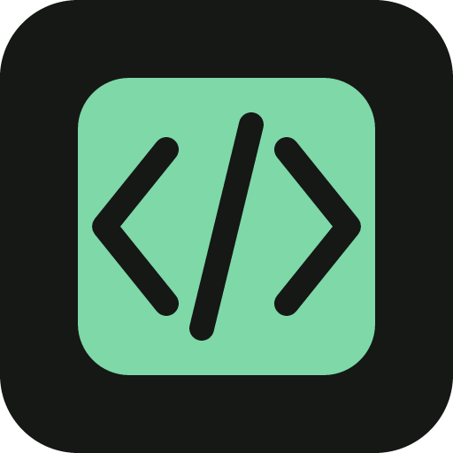
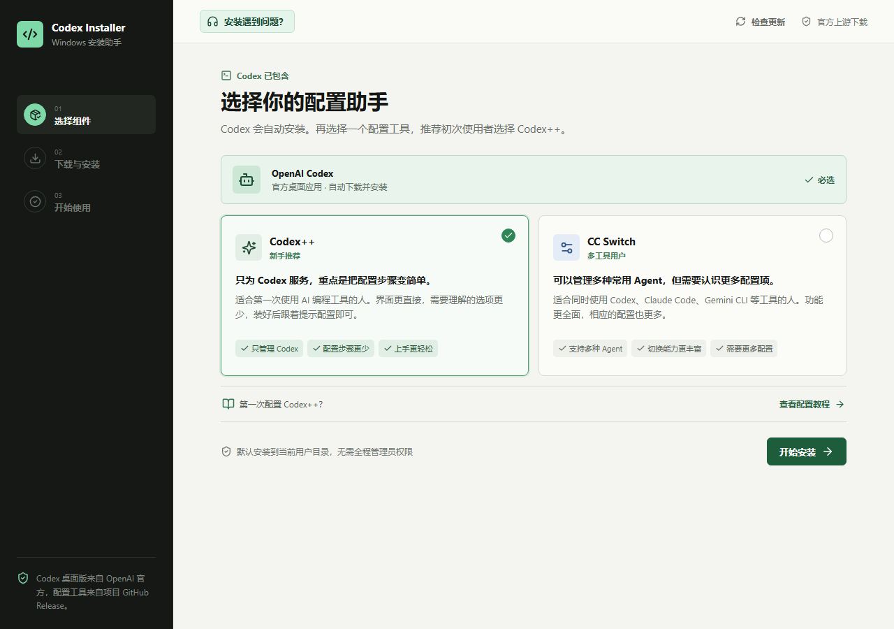
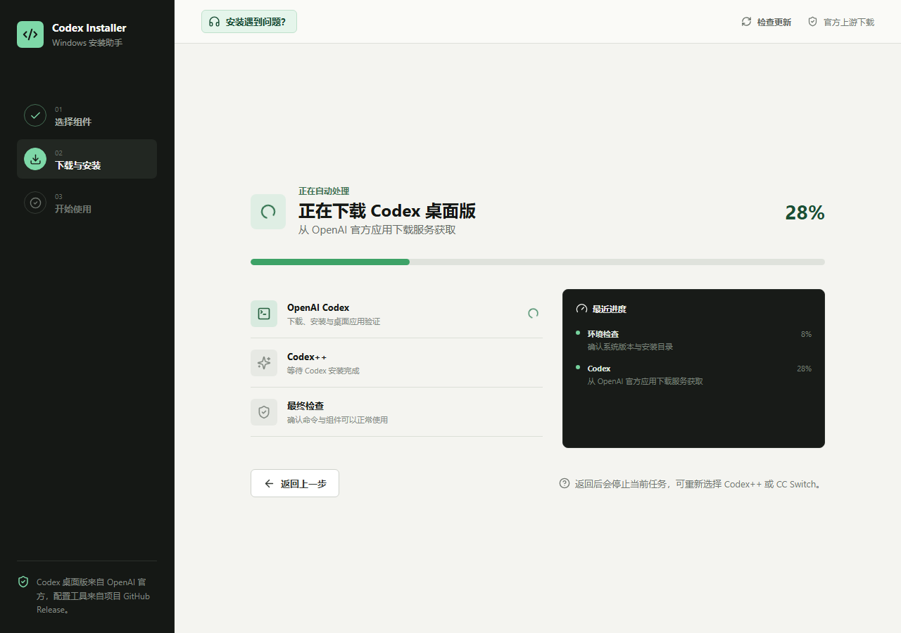
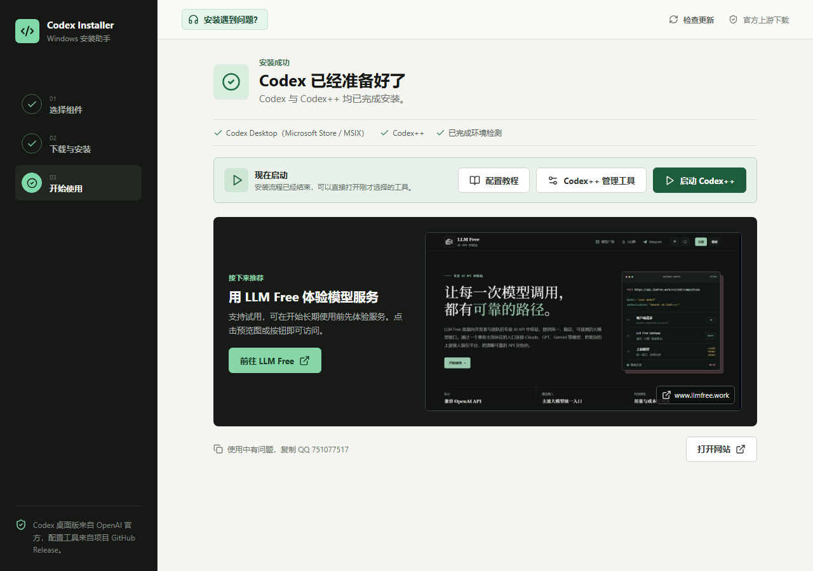
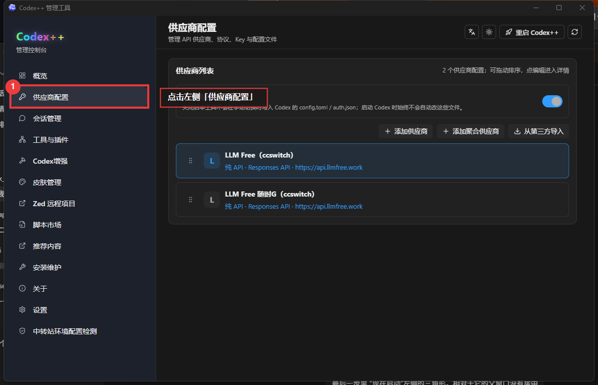
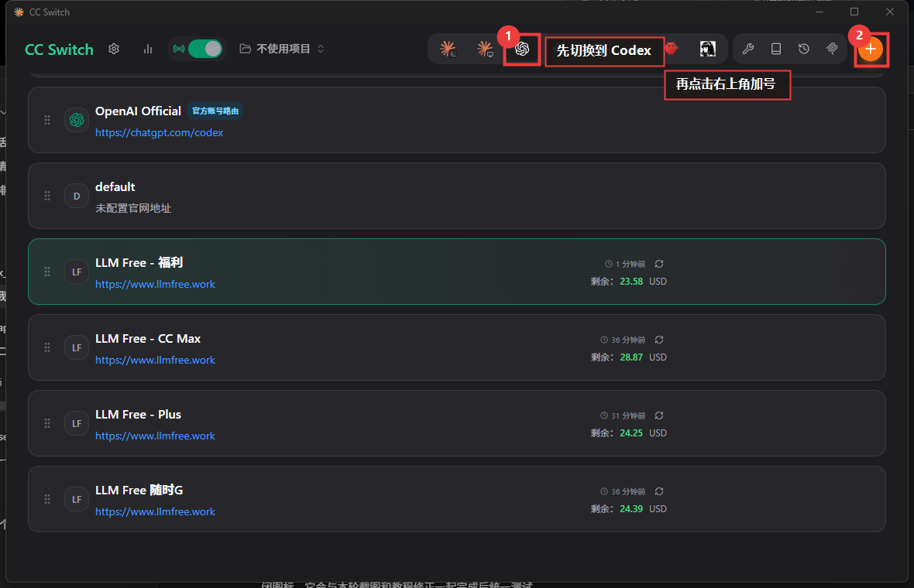
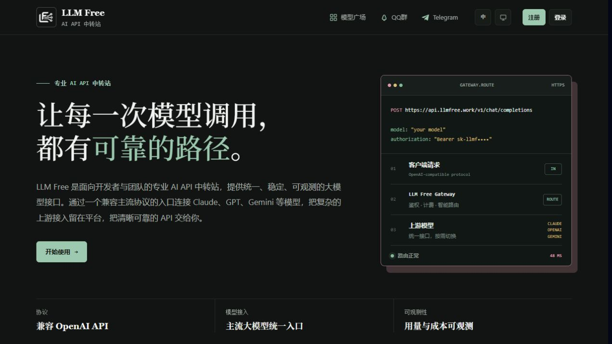

<p align="center">
  
</p>

<h1 align="center">Codex Installer</h1>

<p align="center">面向普通 Windows 用户的 Codex 桌面版一站式安装助手</p>

安装器会先检测电脑中已有的软件，只下载缺少的组件，并引导用户完成 Codex++ 或 CC Switch 的基础配置。

[MIT License](LICENSE) · [问题反馈](https://github.com/abellee/codex_installer/issues) · 安装支持 QQ：`751077517`

> 当前状态：Windows x64 版本已提供公开测试版，macOS 版本尚在适配。请只从本仓库的 [Releases](https://github.com/abellee/codex_installer/releases) 页面下载安装包，不要使用来源不明的转载文件。

## 功能

- 自动检测 Codex 桌面版、Codex++ 和 CC Switch，已安装的组件不会重复下载。
- 自动下载并安装 OpenAI 官方签名的 Codex 桌面版 MSIX。
- 可选择安装 Codex++ 或 CC Switch，默认推荐新手使用 Codex++。
- 下载、安装和验证过程均显示实时进度。
- 安装过程中可以返回重新选择配置工具。
- 安装完成后可直接启动 Codex 和所选配置工具。
- 内置带标注截图的 Codex++、CC Switch 配置教程。
- 教程图片支持全屏查看、缩放、拖动和左右切换。
- 安装遇到问题时，点击顶部入口即可快速复制支持 QQ，并立即显示确认弹窗。
- 启动应用时按钮会进入加载状态，避免连续点击造成重复启动。
- 启动后自动静默检查新版本，也可以通过顶部“检查更新”手动检查、查看更新说明并一键安装。
- 下载会遵循 Windows 系统代理设置，已开启系统代理的用户无需在安装器中重复配置。

## 组件区别

Codex 桌面版会自动包含在安装流程中，用户只需在 Codex++ 和 CC Switch 之间选择一个配置工具。

| 配置工具 | 适合人群 | 特点 |
| --- | --- | --- |
| **Codex++** | 第一次使用 Codex、希望尽量少配置的用户 | 仅面向 Codex，配置步骤少，界面直接，默认推荐 |
| **CC Switch** | 同时使用 Codex、Claude Code、Gemini CLI 等工具的用户 | 支持多种 Agent，功能更丰富，需要理解的配置项也更多 |

## 系统要求

### 普通用户

- Windows 10 或 Windows 11
- x64 或 ARM64 处理器
- 可以访问 OpenAI 官方下载服务及 GitHub Releases
- 安装期间保持网络连接

### 平台支持

| 平台 | 状态 | 说明 |
| --- | --- | --- |
| Windows x64 | 公开测试 | 支持真实检测、下载、安装、启动和应用更新 |
| Windows ARM64 | 适配中 | Codex 官方 MSIX 已支持，配置工具安装流程仍需实机验证 |
| macOS | 计划支持 | 当前仅能运行模拟流程，不能用于真实安装 |

## 使用教程

### 1. 下载并启动

1. 打开项目的 [Releases](https://github.com/abellee/codex_installer/releases) 页面。
2. 下载最新的 Windows 安装包。
3. 完成安装后启动 **Codex Installer**。
4. 如果 Windows 显示安全提醒，请先核对文件来源确实是本仓库的 Release，再继续运行。

### 2. 选择配置工具

1. 在首页查看 Codex++ 和 CC Switch 的区别。
2. 不确定如何选择时，保持默认的 **Codex++** 即可。
3. 点击“开始安装”。

[](docs/images/app-choose.png)

安装器会先检查以下内容：

- Microsoft Store / MSIX 版 Codex 桌面应用。
- 安装在 `Program Files`、`Program Files (x86)` 或当前用户 Programs 目录中的非 Store 桌面版。
- 通过 Windows App Paths 注册的 `Codex.exe` 或 `ChatGPT.exe`。
- 当前选择的 Codex++ 或 CC Switch 是否已经安装。

只有缺少的组件才会进入下载和安装阶段。

### 3. 等待安装完成

安装页面会依次显示环境检测、下载、安装和最终验证进度。安装过程中可以点击“返回上一步”停止当前任务，然后重新选择 Codex++ 或 CC Switch。

[](docs/images/app-installing.png)

完成后可以直接：

- 启动 Codex 桌面版。
- 启动 Codex++ 或 CC Switch。
- 打开所选工具的配置教程。

[](docs/images/app-complete.png)

### 4. 检查安装器更新

Codex Installer 启动后会在后台静默检查本项目最新的 GitHub Release。也可以点击窗口右上角的“检查更新”手动检查：

1. 有新版本时，弹窗会显示当前版本、最新版本和发布说明。
2. 点击“下载并安装”后，可以在弹窗中查看实时下载进度。
3. 下载完成后会校验 GitHub 提供的 SHA-256 摘要（如果该 Release 提供摘要），随后退出当前版本并启动新版安装程序。
4. 更新包只接受本仓库 GitHub Release 下、与当前 Windows CPU 架构匹配的安装程序。

## Codex++ 配置教程

Codex++ 不需要先创建其他配置。打开 **Codex++ 管理工具** 后，直接进入“供应商配置”添加供应商。

1. 点击左侧“供应商配置”。
2. 点击供应商列表上方的“添加供应商”。
3. 使用中转站提供的地址和密钥时，选择“纯 API”接入模式。
4. 填写供应商名称、Base URL 和 API Key。
5. API 类型选择 **Responses API**。
6. 点击“从上游获取”加载模型，再选择需要使用的模型。
7. 保存供应商配置。

[](src/assets/tutorials/codexpp-01-suppliers.png)

应用内教程包含全部五张标注截图，可以点击图片进入全屏模式查看细节。

## CC Switch 配置教程

CC Switch 可以管理多种 Agent，因此配置 Codex 前要先确认当前位于 Codex 页面。

1. 点击顶部的 Codex 图标切换到 Codex。
2. 点击右上角加号添加供应商。
3. 选择“自定义配置”。
4. 填写供应商名称和 API Key。
5. 填写服务商提供的请求地址。
6. 点击默认模型右侧的向下箭头，同步上游模型列表。
7. 同步完成后打开右侧下拉列表，选择默认模型。
8. 保存配置并切换到新供应商。

[](src/assets/tutorials/ccswitch-01-codex.png)

应用内教程包含全部四张标注截图，并支持全屏缩放和左右切换。

## 下载来源与安装规则

| 组件 | 官方来源 | 安装方式 |
| --- | --- | --- |
| Codex 桌面版 | [OpenAI 官方 Windows 下载](https://get.microsoft.com/installer/download/9PLM9XGG6VKS?cid=website_cta_psi) | 按 CPU 架构下载 Store 签名 MSIX，并通过 Windows 应用部署服务安装 |
| Codex++ | [BigPizzaV3/CodexPlusPlus Releases](https://github.com/BigPizzaV3/CodexPlusPlus/releases) | 选择最新的 Windows 安装程序并静默安装 |
| CC Switch | [farion1231/cc-switch Releases](https://github.com/farion1231/cc-switch/releases) | 选择最新的 Windows MSI 并静默安装 |

安装器不会把 API Key、供应商配置或登录信息上传到本项目的服务器。下载文件直接来自上表列出的官方渠道；GitHub 提供 SHA-256 摘要时，安装器会在安装前进行校验。

## 本地开发

### 环境准备

- Node.js 20 或更高版本
- Rust stable 工具链
- Tauri 2 在 Windows 上所需的 WebView2、C++ 构建工具和 Windows SDK

Tauri 的完整系统依赖请参考 [Tauri Prerequisites](https://v2.tauri.app/start/prerequisites/)。

### 启动开发模式

```powershell
git clone https://github.com/abellee/codex_installer.git
cd codex_installer
npm install
npm run tauri dev
```

### 运行检查

```powershell
npm run build
cargo test --manifest-path src-tauri/Cargo.toml --features custom-protocol
cargo clippy --manifest-path src-tauri/Cargo.toml --all-targets --features custom-protocol -- -D warnings
```

### 构建安装包

```powershell
npm run tauri build
```

生成文件位于 `src-tauri/target/release/bundle/`。正式发布前应在目标 Windows 架构上完成真实安装、重复安装、取消安装和启动验证。

## 项目结构

```text
codex_installer/
├─ src/                         React 界面与教程资源
│  ├─ assets/tutorials/         带标注的配置教程截图
│  ├─ App.tsx                   安装流程与交互
│  └─ styles.css                界面样式
├─ src-tauri/                   Tauri/Rust 后端
│  ├─ src/lib.rs                检测、下载、安装与启动逻辑
│  ├─ capabilities/             Tauri 权限配置
│  └─ tauri.conf.json           窗口与打包配置
├─ scripts/                     教程图片处理脚本
└─ README.md
```

## 常见问题

### 已经安装的软件会被覆盖吗？

不会。安装器会先检测 Codex 桌面版和当前选择的配置工具，检测到已安装后直接跳过对应的下载和安装步骤。

### 为什么一直停留在下载阶段？

Codex 桌面版安装包体积较大，具体耗时取决于网络速度。请保持安装器运行并确认 OpenAI 官方下载服务可以访问。

### 安装失败后如何反馈？

保留失败页面显示的错误信息，点击界面左上角的“安装遇到问题？”；弹窗确认复制成功后，通过 QQ `751077517` 联系维护者。

### 安装器如何更新？

点击窗口右上角的“检查更新”。如果有新版本，可以直接查看更新说明、下载安装包并启动更新。安装器不会从第三方镜像下载自身更新，只接受本仓库 GitHub Release 中的 Windows 安装包。

### 可以在 macOS 上真实安装吗？

暂时不可以。macOS 当前仅用于界面和流程测试，真实下载、安装、检测、启动与签名流程仍在适配。

## 参与贡献

欢迎通过 [Issues](https://github.com/abellee/codex_installer/issues) 报告问题或提出建议，也欢迎提交 Pull Request。

提交代码前请确保：

1. 改动范围清晰，不包含无关格式化或生成文件。
2. `npm run build` 可以通过。
3. `cargo test --manifest-path src-tauri/Cargo.toml` 可以通过。
4. 涉及安装流程的改动说明测试系统、CPU 架构和是否执行了真实安装。
5. 不提交 API Key、登录凭据、个人路径或其他敏感信息。

## 安全说明

- 只从本仓库 Release 和上游官方渠道下载安装文件。
- 不要在 Issue、截图或日志中公开 API Key、访问令牌和账号信息。
- 本项目会执行第三方项目提供的官方安装程序；使用前请同时阅读对应上游项目的许可证和安全说明。
- 发现安全问题时，请优先通过 QQ `751077517` 私下联系维护者，不要先公开可利用细节。

## 许可证

本项目使用 [MIT License](LICENSE)。Codex、Codex++、CC Switch 及其商标、安装包和源代码分别归各自权利人所有，本项目的 MIT 许可证不覆盖这些第三方组件。

## 推荐：LLM Free 模型中转站

安装并启动 Codex 后，如果需要配置支持 Responses API 的模型服务，可以试用 [LLM Free](https://www.llmfree.work)。网站支持试用，注册后可在控制台获取 Base URL、API Key 和可用模型信息，再按照应用内的 Codex++ 或 CC Switch 教程完成配置。

[](https://www.llmfree.work)

> LLM Free 是项目维护者推荐的第三方中转服务，不是 OpenAI 官方服务。使用前请自行了解其计费、隐私与服务条款。
